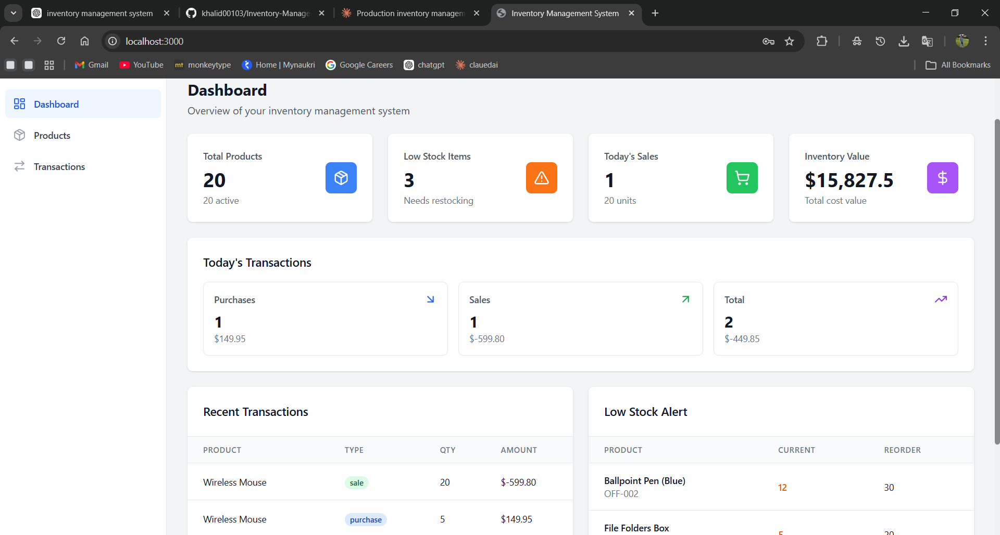
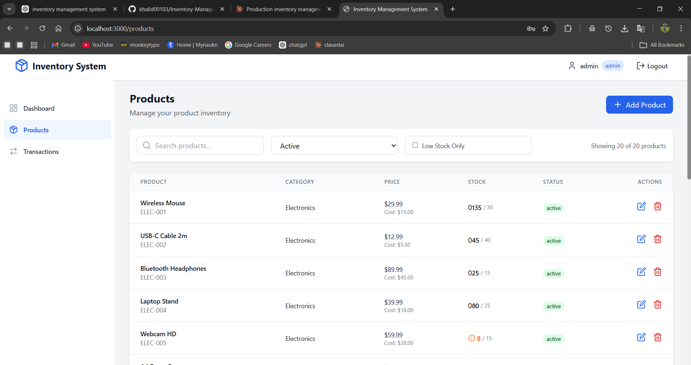
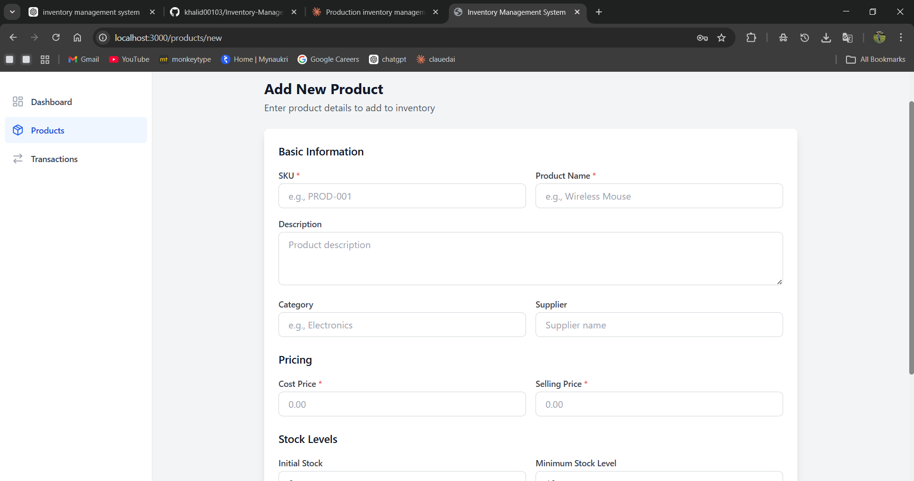
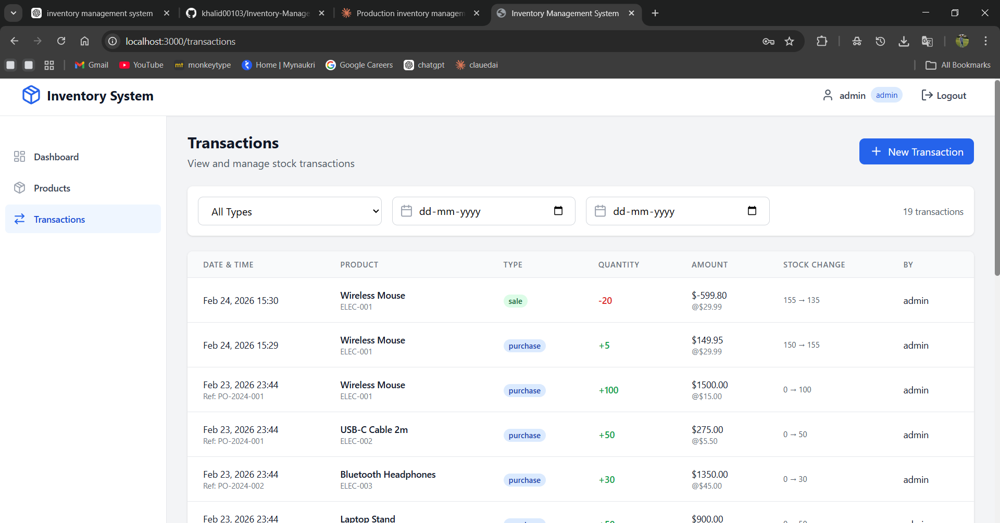
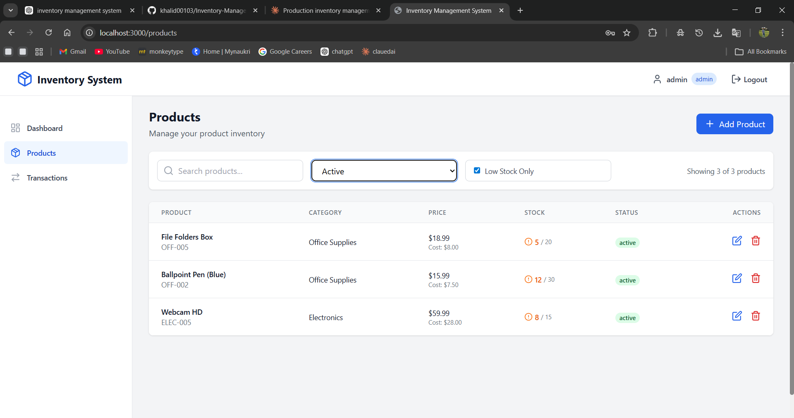

# Production-Grade Inventory Management System

A comprehensive, scalable inventory management system built with modern web technologies and production-ready patterns.

## 📸 Application Screenshots

### Dashboard


### Products


### Add Product


### Transactions


### Low Stock Alerts


## 🚀 Tech Stack

### Frontend
- **React.js 18** - Modern UI library with hooks
- **React Router v6** - Client-side routing
- **Tailwind CSS** - Utility-first styling
- **Axios** - HTTP client with interceptors
- **React Toastify** - User notifications
- **Lucide React** - Modern icon library
- **Date-fns** - Date formatting

### Backend
- **Node.js** - Runtime environment
- **Express.js** - Web framework
- **MySQL** - Relational database
- **JWT** - Authentication
- **bcryptjs** - Password hashing
- **express-validator** - Input validation
- **Helmet** - Security headers
- **Morgan** - HTTP logging
- **Compression** - Response compression

## 📋 Features

### Core Functionality
✅ User authentication with JWT  
✅ Role-based access control (Admin, Manager, Staff)  
✅ Product CRUD operations  
✅ Stock transaction management  
✅ Real-time stock updates  
✅ Low stock alerts  
✅ Dashboard with analytics  
✅ Transaction history  
✅ Category management  

### Technical Features
✅ Database connection pooling  
✅ Transaction-based stock updates (ACID compliance)  
✅ Row-level locking for concurrent safety  
✅ Input validation and sanitization  
✅ Error handling at all layers  
✅ Rate limiting  
✅ CORS configuration  
✅ Pagination for large datasets  
✅ Indexed database queries  

## 🏗️ Architecture

### Database Schema
```
users
  ├── id (PK)
  ├── username (UNIQUE)
  ├── password (HASHED)
  ├── email
  ├── role
  └── timestamps

products
  ├── id (PK)
  ├── sku (UNIQUE, INDEXED)
  ├── name (INDEXED)
  ├── category (INDEXED)
  ├── prices
  ├── stock_levels
  └── timestamps

stock_transactions
  ├── id (PK)
  ├── product_id (FK, INDEXED)
  ├── transaction_type
  ├── quantity
  ├── stock_before
  ├── stock_after
  ├── created_by (FK)
  └── timestamp (INDEXED)
```

### API Endpoints

#### Authentication
```
POST   /api/v1/auth/login       - Login
POST   /api/v1/auth/logout      - Logout
GET    /api/v1/auth/profile     - Get user profile
```

#### Products
```
GET    /api/v1/products         - List products (paginated)
GET    /api/v1/products/:id     - Get product by ID
POST   /api/v1/products         - Create product (Admin/Manager)
PUT    /api/v1/products/:id     - Update product (Admin/Manager)
DELETE /api/v1/products/:id     - Delete product (Admin)
GET    /api/v1/products/low-stock - Get low stock items
```

#### Transactions
```
GET    /api/v1/transactions     - List transactions (paginated)
POST   /api/v1/transactions     - Create transaction
GET    /api/v1/transactions/today - Today's transactions
GET    /api/v1/transactions/summary - Transaction summary
```

#### Dashboard
```
GET    /api/v1/dashboard/summary - Dashboard overview
GET    /api/v1/dashboard/sales-analytics - Sales data
GET    /api/v1/dashboard/top-selling - Top products
```

## 🔧 Installation & Setup

### Prerequisites
- Node.js >= 18.0.0
- MySQL >= 8.0
- npm >= 9.0.0

### 1. Clone Repository
```bash
git clone <repository-url>
cd inventory-system
```

### 2. Database Setup
```bash
# Login to MySQL
mysql -u root -p

# Create database
CREATE DATABASE inventory_db;

# Import schema
mysql -u root -p inventory_db < database/schema.sql

# Import sample data
mysql -u root -p inventory_db < database/sample-data.sql
```

### 3. Backend Setup
```bash
cd backend

# Install dependencies
npm install

# Configure environment variables
cp .env.example .env

# Edit .env with your database credentials
# DB_HOST=localhost
# DB_USER=root
# DB_PASSWORD=your_password
# DB_NAME=inventory_db
# JWT_SECRET=your_secret_key

# Start development server
npm run dev

# Or start production server
npm start
```

Backend will run on `http://localhost:5000`

### 4. Frontend Setup
```bash
cd frontend

# Install dependencies
npm install

# Create .env file
echo "VITE_API_BASE_URL=http://localhost:5000/api/v1" > .env

# Start development server
npm run dev

# Or build for production
npm run build
```

Frontend will run on `http://localhost:3000`

## 🔐 Default Login Credentials

```
Admin Account:
Username: admin
Password: admin123

Manager Account:
Username: manager
Password: admin123

Staff Account:
Username: staff
Password: admin123
```

## 📊 How It Works

### Real-Time Stock Updates
The system uses **database transactions** with **row-level locking** to ensure data consistency:

```javascript
// When a transaction is created:
1. Lock the product row (FOR UPDATE)
2. Calculate new stock level
3. Validate stock availability
4. Insert transaction record
5. Update product stock
6. Commit all changes atomically
```

This prevents race conditions when multiple users perform transactions simultaneously.

### Data Consistency
- **ACID Transactions**: All stock changes are atomic
- **Foreign Key Constraints**: Referential integrity enforced
- **Check Constraints**: Stock levels validated at database level
- **Audit Trail**: Complete history in stock_transactions table

### Scalability Features
- **Connection Pooling**: Reuses database connections
- **Indexed Queries**: Fast lookups on SKU, category, dates
- **Pagination**: Limits memory usage for large datasets
- **Materialized Views**: Pre-computed low stock alerts

## 🧪 Testing

### API Testing with cURL

#### Login
```bash
curl -X POST http://localhost:5000/api/v1/auth/login \
  -H "Content-Type: application/json" \
  -d '{"username":"admin","password":"admin123"}'
```

#### Get Products
```bash
curl http://localhost:5000/api/v1/products \
  -H "Authorization: Bearer YOUR_TOKEN"
```

#### Create Transaction
```bash
curl -X POST http://localhost:5000/api/v1/transactions \
  -H "Content-Type: application/json" \
  -H "Authorization: Bearer YOUR_TOKEN" \
  -d '{
    "product_id": 1,
    "transaction_type": "sale",
    "quantity": 5,
    "unit_price": 29.99,
    "reference_number": "SO-2024-001"
  }'
```

## 📈 Performance Optimizations

1. **Database Level**
   - Composite indexes on common query patterns
   - Connection pooling (10 connections)
   - Prepared statements

2. **API Level**
   - Response compression
   - Rate limiting (100 req/15min)
   - Pagination on all lists

3. **Frontend Level**
   - Code splitting
   - Debounced search
   - Optimistic UI updates

## 🔒 Security Features

- JWT authentication with secure tokens
- Password hashing with bcrypt (10 rounds)
- Role-based access control (RBAC)
- Input validation on all endpoints
- SQL injection prevention (prepared statements)
- XSS protection (helmet.js)
- CORS configuration
- Rate limiting
- Secure HTTP headers

## 📁 Project Structure

```
inventory-system/
├── backend/
│   ├── src/
│   │   ├── config/        # Database, environment
│   │   ├── models/        # Data layer
│   │   ├── controllers/   # Business logic
│   │   ├── routes/        # API routes
│   │   ├── middleware/    # Auth, validation
│   │   └── server.js      # Entry point
│   └── package.json
├── frontend/
│   ├── src/
│   │   ├── components/    # Reusable UI
│   │   ├── pages/         # Route pages
│   │   ├── contexts/      # Global state
│   │   ├── services/      # API calls
│   │   └── App.jsx        # Root component
│   └── package.json
├── database/
│   ├── schema.sql         # Database structure
│   └── sample-data.sql    # Test data
└── ARCHITECTURE.md        # Technical docs
```

## 🚀 Deployment

### Backend Deployment
```bash
# Set environment to production
NODE_ENV=production

# Use PM2 for process management
npm install -g pm2
pm2 start src/server.js --name inventory-api
pm2 save
pm2 startup
```

### Frontend Deployment
```bash
# Build for production
npm run build

# Serve with nginx or any static server
# Output in /dist folder
```

### Database Deployment
- Use connection pooling
- Enable slow query log
- Set up automated backups
- Configure replication for high availability

## 📝 Future Enhancements

- [ ] Redis caching for frequently accessed data
- [ ] WebSocket for real-time updates
- [ ] CSV/Excel import/export
- [ ] Barcode scanning
- [ ] Multi-warehouse support
- [ ] Email notifications
- [ ] Advanced reporting
- [ ] Mobile application

## 🤝 Contributing

1. Fork the repository
2. Create a feature branch
3. Commit your changes
4. Push to the branch
5. Create a Pull Request

## 📄 License

MIT License - See LICENSE file for details

## 👥 Support

For issues and questions:
- Create an issue on GitHub
- Email: support@example.com

---

**Built with ❤️ for production environments**
